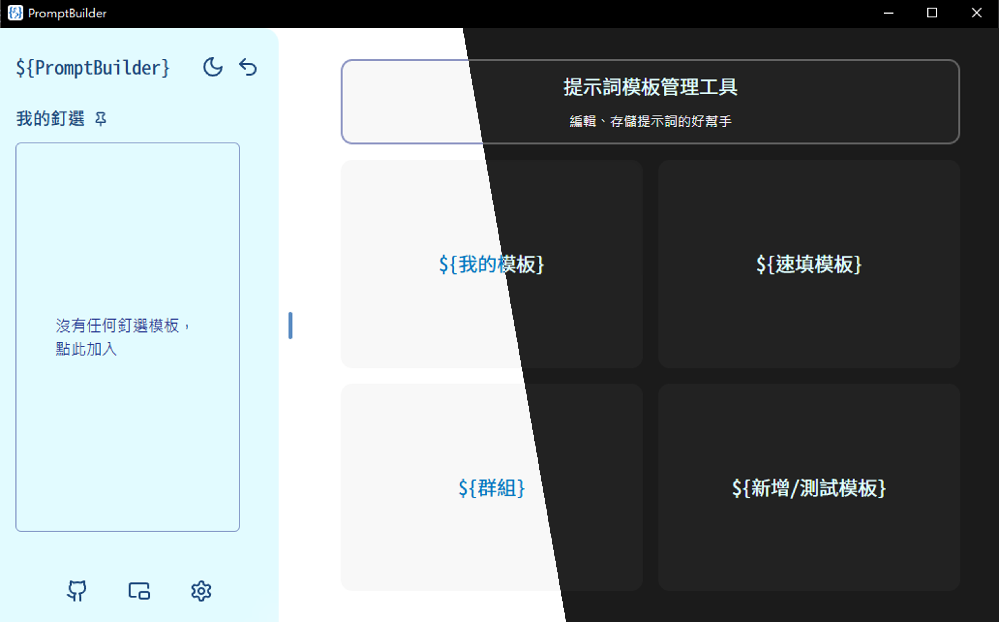
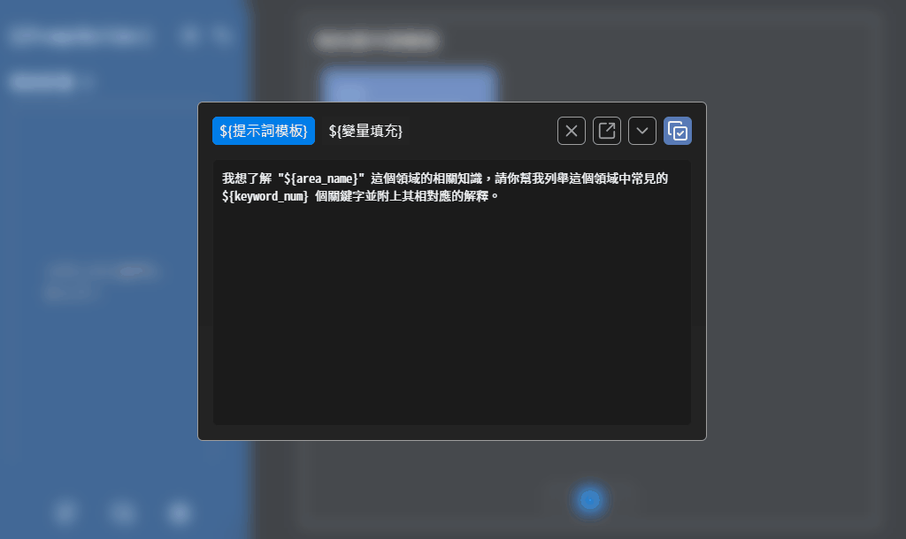
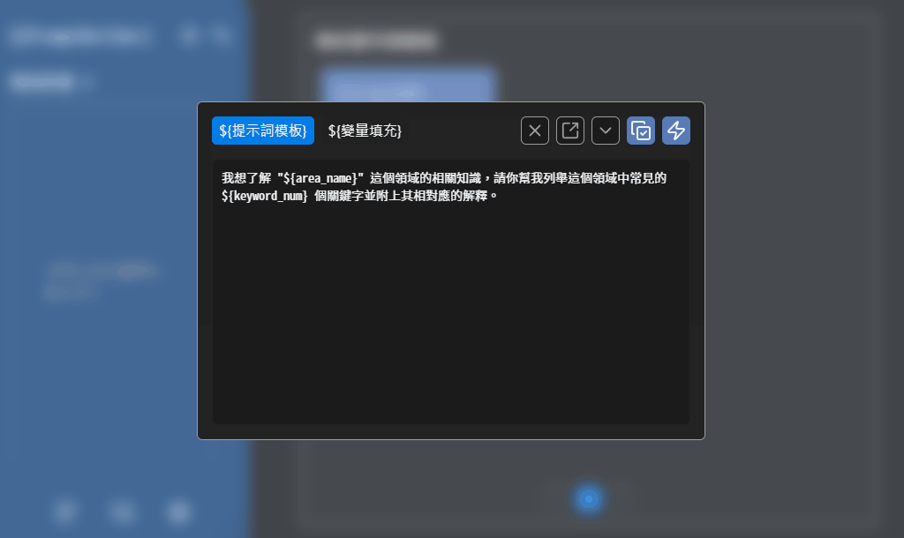
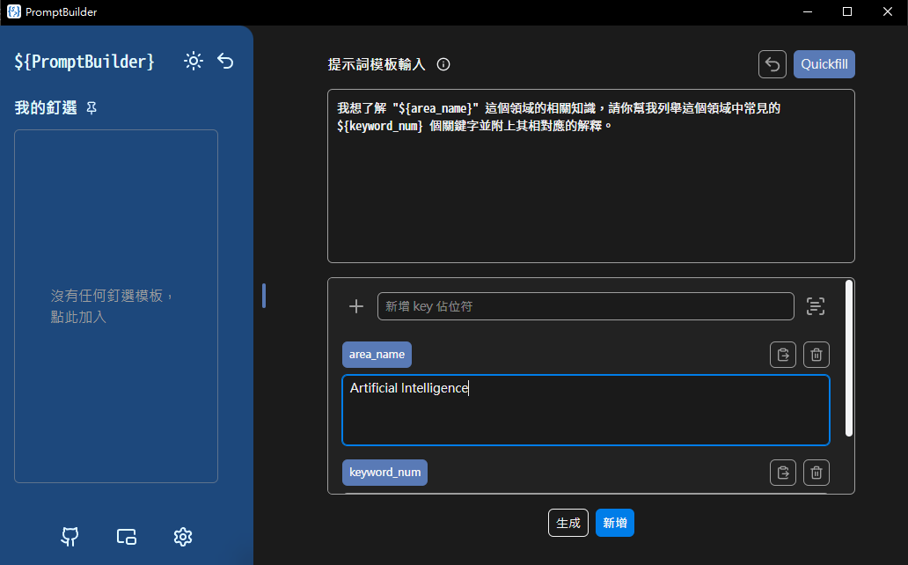
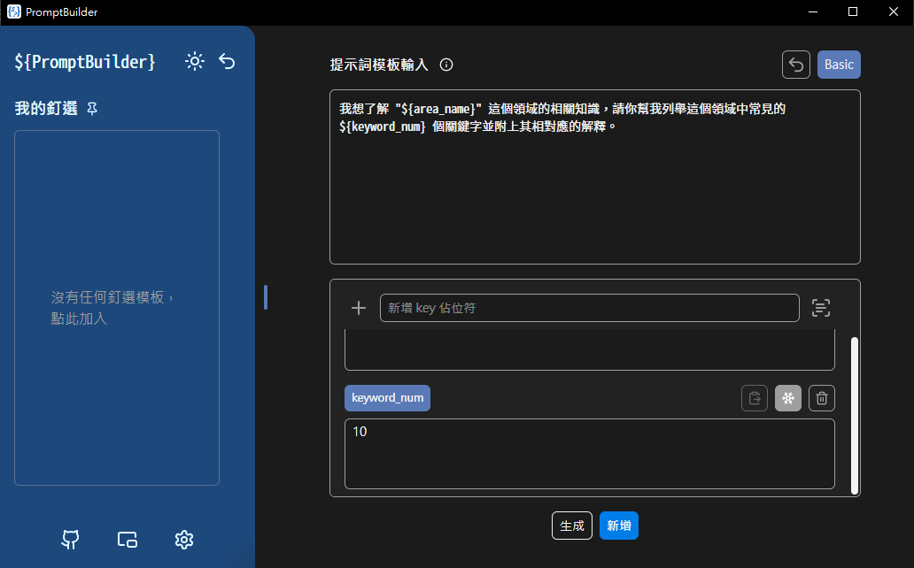

<div align="center">
<p align="center">

</p>
<h1>Prompt Builder</h1>
<br>
</div>

Prompt Builder 是一款專注於提示詞模板管理的桌面端應用工具，旨在幫助用戶高效地管理、使用已有提示詞模板。

<br>
<p align="center">

</p>

## 功能

- **`平台支持`**：支援 Windows、MacOS 平台
- **`優雅拼接`**：先設計模板，一鍵產出完整 Prompt，讓拼接與組合全自動完成，效率全面升級
- **`無縫拼接`**：單一欄位模板支援剪貼簿自動帶入，拼接完成後直接覆寫剪貼簿
- **`自定義檔案格式`**：使用自定義 `.promptbuilder.json` 作為導入導出文件格式，便於提示詞數據的備份與分享無縫銜接

## 如何使用

### 使用提示詞模板

<br>
<p align="center">

</p>

### 使用速填提示詞模板

<br>
<p align="center">

</p>

### 普通提示詞模板設計

<br>
<p align="center">

</p>
<br>

提示詞模板填寫規則
- 變量規則
  - 須符合 `${key}` 的格式
  - `key` 只能是英文字母、數字、底線的組合
  - 開頭不能是數字
  - 例如： `${name}` 、 `${age}` 、 `${_id}` 
- 變量數量不限，可以有多個變量

#### Template Example

```template
我想了解 "${area_name}" 這個領域的相關知識，請你幫我列舉這個領域中常見的 ${keyword_num} 個關鍵字並附上其相對應的解釋。
```

此時，系統可以捕獲到 `area_name` 以及 `keyword_num` 這兩個變量。我們可以通過填入這兩個變量，拼出對應提示詞。

**Input** (填入)

```template-input
area_name = "Artificial Intelligence"
keyword_num = "10"
```

**Output**

```template-output
我想了解 "Artificial Intelligence" 這個領域的相關知識，請你幫我列舉這個領域中常見的 10 個關鍵字並附上其相對應的解釋。
```

### 速填提示詞模板設計

<br>
<p align="center">

</p>
<br>

速填提示詞模板填寫規則
- 變量規則
  - 須符合 `${key}` 的格式
  - `key` 只能是英文字母、數字、底線的組合
  - 開頭不能是數字
  - 例如： `${name}` 、 `${age}` 、 `${_id}` 
- 待填入的變量數量只能有 1 項
  - 若有多個變量，需設置 "凍結項" 直到 "非凍結項" 只有 1 項

#### Quickfill Template Example

```template
我想了解 "${area_name}" 這個領域的相關知識，請你幫我列舉這個領域中常見的 ${keyword_num} 個關鍵字並附上其相對應的解釋。
```

此時，系統可以捕獲到 `area_name` 以及 `keyword_num` 這兩個變量。我們可以通過填入這兩個變量，拼出對應提示詞。

不過，因為我們有兩個變量 (變量數量 > 1) 因此需要凍結 1 個變量，使其自由填入的變量為 1 項。這裡，我們凍結 `keyword_num` ，並讓 `area_name` 保持可自由填入的狀態。

```template-var
keyword_num = "10" ("凍結/freeze")
```

**Input** (複製/填入)

```template-input
area_name = "Artificial Intelligence"
```

**Output**

```template-output
我想了解 "Artificial Intelligence" 這個領域的相關知識，請你幫我列舉這個領域中常見的 10 個關鍵字並附上其相對應的解釋。
```
